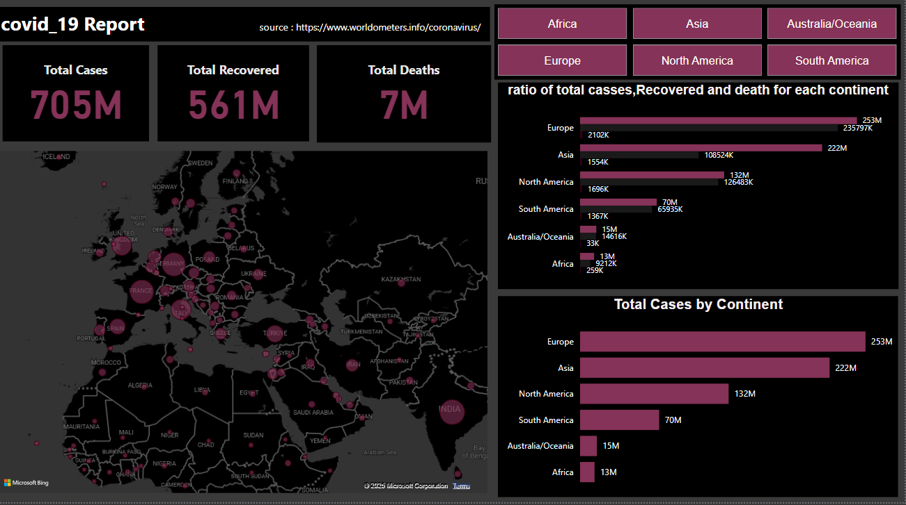

# COVID_19_PowerBi
my first Power BI dashboard created using data from Worldometers about the COVID-19 pandemic.

🔍 Dashboard Details:
_In-depth analysis of cases, recoveries, and deaths across different countries.

_Interactive charts and map that help track the daily progression of the pandemic.

_Flexibility to filter data by country or continent and compare numbers between nations.

Data source : https://lnkd.in/df7AN8yh

